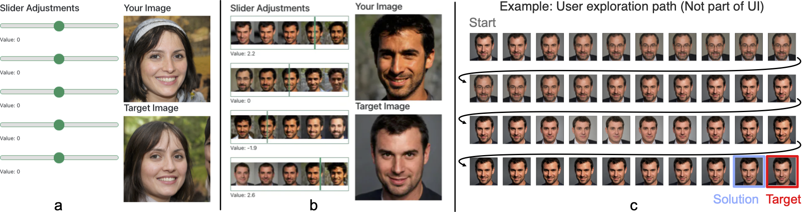

> **GANSlider: How Users Control Generative Models for Images]{GANSlider: How Users Control Generative Models for Images using Multiple Sliders with and without Feedforward Information**<br>
> Hai Dang<sup>1</sup>, Lukas Mecke<sup>2,3</sup>, Daniel Buschek<sup>1</sup><br>
> <sup>1</sup>University of Bayreuth, <sup>2</sup>Bundeswehr University Munich, <sup>3</sup>LMU Munich<br>
> <p align="justify"><b>Paper Link:</b> 
  > <a href="https://arxiv.org/abs/2202.00965">https://arxiv.org/abs/2202.00965</a>
>
> <p align="justify"><b>Abstract:</b> <i>We investigate how multiple sliders with and without feedforward visualizations influence users' control of generative models. In an online study (N=138), we collected a dataset of people interacting with a generative adversarial network (\textit{StyleGAN2}) in an image reconstruction task. We found that more control dimensions (sliders) significantly increase task difficulty and user actions. Visual feedforward partly mitigates this by enabling more goal-directed interaction. However, we found no evidence of faster or more accurate task performance. This indicates a tradeoff between feedforward detail and implied cognitive costs, such as attention. Moreover, we found that visualizations alone are not always sufficient for users to understand individual control dimensions. Our study quantifies fundamental UI design factors and resulting interaction behavior in this context, revealing opportunities for improvement in the UI design for interactive applications of generative models. We close by discussing design directions and further aspects.</i></p>
> <p align="justify"><b>Video:</b> 
> TBA

## System tested with

- Cuda Toolkit version 10+
- Python version 3.7
- MongoDB running on default port (27017)
- Docker


## Citation
```
@inproceedings{10.1145/3491102.3502141,
  author = {Dang, Hai and Mecke, Lukas and Buschek, Daniel},
  title = {GANSlider: How Users Control Generative Models for Images Using Multiple Sliders with and without Feedforward Information},
  year = {2022},
  isbn = {9781450391573},
  publisher = {Association for Computing Machinery},
  address = {New York, NY, USA},
  url = {https://doi.org/10.1145/3491102.3502141},
  doi = {10.1145/3491102.3502141},
  abstract = {We investigate how multiple sliders with and without feedforward visualizations influence users’ control of generative models. In an online study (N=138), we collected a dataset of people interacting with a generative adversarial network (StyleGAN2) in an image reconstruction task. We found that more control dimensions (sliders) significantly increase task difficulty and user actions. Visual feedforward partly mitigates this by enabling more goal-directed interaction. However, we found no evidence of faster or more accurate task performance. This indicates a tradeoff between feedforward detail and implied cognitive costs, such as attention. Moreover, we found that visualizations alone are not always sufficient for users to understand individual control dimensions. Our study quantifies fundamental UI design factors and resulting interaction behavior in this context, revealing opportunities for improvement in the UI design for interactive applications of generative models. We close by discussing design directions and further aspects. },
  booktitle = {CHI Conference on Human Factors in Computing Systems},
  articleno = {569},
  numpages = {15},
  keywords = {generative adversarial network, interactive AI, dataset, user study, image manipulation},
  location = {New Orleans, LA, USA},
  series = {CHI '22}
}
```

## License

The code of this repository is released under the [Apache 2.0](LICENSE) license.<br>


# ENVIRONMENT VARIABLES

GANSLIDER_DEBUGGING = [0|1] # **Set this environment variable if you need debugging.**
GANSLIDER_PROLIFIC_URL = "" # **Set this environment variable to define the callback link to prolific.**
REACT_APP_ROOT_DIR = "/" **

# Setup with Docker
1. Setup submodules: `git submodule update --init --recursive`
2. Rename *.env.example* file to *.env*
3. Run docker-compose: `docker-compose up --scale app=3`
4. Open Browser and navigate to: `http://localhost:8888/user-study?PROLIFIC_PID=mock_id&STUDY_ID=mock_id&SESSION_ID=mock_session`


# Run with Windows (without WSL 2) in DEBUG MODE
1. Install Nvidida Driver
2. Setup Backend
    - Change to the *backend* directory
    - Install dependencies: ```pip install -r requirements.txt```
    - Install pytorch for cuda 10.2: https://pytorch.org/get-started/previous-versions/#v181
    - Set Windows System Environment Variable: ```GANSLIDER_BACKEND_SERVE=1``` 
    - Run: ```uvicorn server:app --workers 1 --host 0.0.0.0 --port 8000```
3. Setup Fronted:
    - Change to *frontend* directory
    - Run: ```npm i```
    - Set Windows System Environment Variable: ```REACT_APP_ROOT_DIR=/```
    - Run: ```npm run build``
4. Open Browser and navigate to: `http://localhost:8000/user-study?PROLIFIC_PID=mock_id&STUDY_ID=mock_id&SESSION_ID=mock_session`


